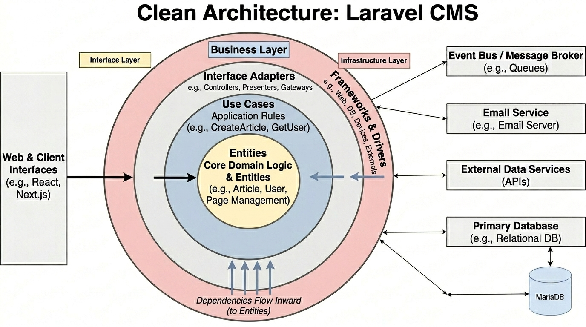
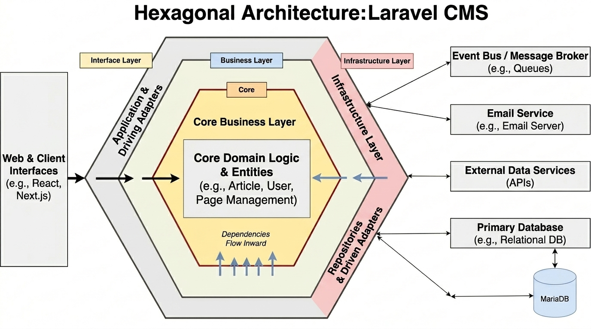

<h1>Índice</h1>

1. [Introducción](#introducción)
2. [Arquitectura Limpia (Por capas)](#arquitectura-limpia-por-capas)
3. [Arquitectura Hexagonal (Ports and Adapters)](#arquitectura-hexagonal-ports-and-adapters)
4. [Arquitectura elegida para el CMS](#arquitectura-elegida-para-el-cms)
5. [Stack tecnológico para la implementación de la Arquitectura Hexagonal](#stack-tecnológico-para-la-implementación-de-la-arquitectura-hexagonal)
6. [Partes de la arquitectura elegida con el Stack](#partes-de-la-arquitectura-elegida-con-el-stack)


### Introducción

Para el desarrollo de un CMS, la elección de la arquitectura es el factor más determinante para la vida útil del software. Buscamos una estructura que permita que el negocio sea independiente de la tecnología utilizada.

Tras un análisis de las mejores opciones disponibles, se optó por dos candidatos principales: **Arquitectura Hexagonal** y **Arquitectura Limpia**. Ambas arquitecturas comparten principios fundamentales de separación de responsabilidades, independencia de frameworks y testabilidad, pero tienen enfoques ligeramente diferentes en la organización de los componentes.

### Arquitectura Limpia (Por capas)

En la Arquitectura Limpia, el sistema se organiza en capas concéntricas, donde cada capa tiene una responsabilidad específica y depende solo de las capas internas. Las capas típicas incluyen:

#### **Dominio**
   
   Es el núcleo del sistema y contiene la lógica de negocio pura.

  - Se definen las entidades y modelos de negocio, `User`, `Article`, `Section`, `Banner` y `Tag` como clases con atributos y métodos relacionados.
  - Contiene la lógica de negocio pura sin dependencias externas.
  - No conoce detalles de la infraestructura, bases de datos o frameworks, solo las reglas y comportamientos del dominio.
  - Ej: Un `Article` conoce su estado (borrador, publicado), pero no sabe nada sobre cómo se almacena o se muestra.
  
#### **Aplicación**

Se encarga de coordinar el flujo del sistema.

   - Contiene los casos de uso, que son las operaciones que el sistema puede realizar, como `CreateArticle`, `PublishArticle`, `AssignTagToArticle`.
   - Define la lógica de aplicación sin preocuparse de la infraestructura.
   - Ej: El caso de uso `PublishArticle` podría verificar que el artículo cumple con ciertos criterios antes de cambiar su estado a publicado, pero no se encarga de cómo se guarda en la base de datos, de eso se encargan las capas inferiores, la de dominio.

#### **Infraestructura**

Es la capa más externa del sistema.

   - Implementa la persistencia (base de datos, APIs externas, almacenamiento de archivos).
   - Aquí se incluyen las tecnologías como `MariaDB`, `AWS S3` o servicios de conexión de email.
   - Ej: Un repositorio `ArticleRepository` que implementa la interfaz definida en el dominio para guardar y recuperar artículos de una base de datos MySQL.

#### **Interfaz**

Es la capa de entrada al sistema.

   - Contiene los controladores, vistas y cualquier componente que interactúe con el usuario o sistemas externos.
   - Se encarga de recibir las solicitudes, invocar los casos de uso y devolver las respuestas.
   - Ej: Un controlador `ArticleController` que recibe una solicitud HTTP para crear un artículo, valida los datos, llama al caso de uso `CreateArticle` y devuelve una respuesta JSON.

#### Imágen de la Arquitectura Limpia en el contexto de un CMS:


### Arquitectura Hexagonal (Ports and Adapters)
La Arquitectura Hexagonal comparte la misma filosofía de separación, pero estructura el sistema alrededor de un núcleo central (dominio + casos de uso), rodeado de adaptadores.

#### **Núcleo**

Contiene la lógica de negocio pura, similar a la capa de dominio en la Arquitectura Limpia.

   - Define las entidades y casos de uso sin depender de detalles de infraestructura.
   - Ej: Un `Article` con sus atributos y métodos, y casos de uso como `PublishArticle` que encapsula la lógica para publicar un artículo.

#### **Puertos**

Son interfaces que definen cómo el núcleo interactúa con el mundo exterior.

   - Incluyen interfaces para repositorios, servicios externos, etc.
   - Ej: Un puerto `ArticleRepository` que define métodos como `save(Article article)` y `findById(Long id)`.

#### **Adaptadores**

Implementan los puertos para interactuar con tecnologías específicas.

   - Adaptadores de entrada: controladores, interfaces de usuario.
   - Adaptadores de salida: implementaciones de repositorios, clientes de APIs externas.
   - Ej: Un adaptador `MySQLArticleRepository` que implementa el puerto `ArticleRepository` usando JDBC o un ORM para interactuar con una base de datos MySQL.

#### Imágen de la Arquitectura Hexagonal en el contexto de un CMS:


### Arquitectura elegida para el CMS

Tras analizar ambas arquitecturas, se ha optado por la **Arquitectura Hexagonal** (Ports & Adapters) debido a su fuerte enfoque en la independencia del núcleo de negocio y la flexibilidad para integrar distintas tecnologías a través de adaptadores.

Este enfoque permite que el sistema evolucione con el tiempo sin afectar la lógica de negocio, lo cual es especialmente importante en un CMS que debe adaptarse a nuevas necesidades funcionales, tecnológicas y de escalabilidad.

````bash
 React
   ↓
Next.js (BFF)
   ↓
Laravel API
   ↓
Use Cases
   ↓
 Domain
   ↓
 Ports
   ↓
Adapters
   ↓
MariaDB
````

### Stack tecnológico para la implementación de la Arquitectura Hexagonal:

| Capa / Componente                 | Tecnología     | Descripción                                   |
|----------------------------------|----------------|-----------------------------------------------|
| Backend principal                | Laravel        | API REST que gestiona la lógica de negocio   |
| Base de datos                    | MariaDB        | Almacenamiento de datos relacional            |
| Frontend público y CMS UI       | React          | Interfaz de usuario para clientes y CMS       |
| Backend de composición / SSR    | Next.js        | BFF (Backend For Frontend) para SSR y orquestación |

### Partes de la arquitectura elegida con el Stack:
### **1. Núcleo del dominio (Laravel)**

El núcleo del sistema contiene la lógica de negocio del CMS y es independiente de cualquier framework o base de datos.

Incluye:

### Entidades de dominio:
- `Article`  
- `Category` / `Section`  
- `Tag`  
- `User`  
- `Banner`  
- `Comment`  

### Reglas de negocio:
- Estados de artículos (`draft`, `published`, `archived`)  
- Relaciones entre contenido  
- Validaciones de dominio  

Este núcleo no conoce ni MariaDB, ni Eloquent, ni Next.js.

---

### **2. Puertos (Ports)**

Los puertos definen qué necesita el sistema para funcionar, sin especificar cómo se implementa.

Incluyen:

- `ArticleRepositoryInterface`  
- `SectionRepositoryInterface`  
- `MediaStorageInterface`  
- `MailServiceInterface`  

Son contratos puros que desacoplan el dominio de la infraestructura.

---

### **3. Adaptadores (Adapters)**

Los adaptadores implementan los puertos y conectan el sistema con tecnologías externas.

#### Adaptadores de salida:
- `MariaDB` (implementación de repositorios con Eloquent o SQL)  
- `AWS S3` (almacenamiento de media)  
- `Servicios de email` (SMTP, SendGrid, etc.)  

#### Adaptadores de entrada:
- Controladores REST en Laravel (API)  
- Next.js (BFF / consumo de API)  
- CLI commands  

---

### **4. Next.js como BFF**

Next.js actúa como **Backend For Frontend (BFF)** y capa de orquestación.

### Responsabilidades:
- SSR / ISR para mejorar rendimiento y SEO  
- Agregación de datos desde Laravel  
- Transformación de respuestas para React  
- Cacheo de contenido  

No contiene lógica de negocio, solo composición de datos.

---

### **5. React como capa de presentación**

React es la capa de interfaz de usuario:

- CMS (panel de administración)  
- Sitio público de noticias  

Su responsabilidad es exclusivamente visual e interactiva.

---

### **6. Rol de MariaDB**

MariaDB es un detalle de infraestructura dentro del sistema.

- Gestionado exclusivamente desde los adaptadores de persistencia  
- Totalmente aislado del dominio  
- Intercambiable sin afectar la lógica de negocio  

---

### **7. Principios de implementación**

Para garantizar la correcta aplicación de la arquitectura hexagonal, se aplican los siguientes patrones:

- **Inyección de dependencias**  
  Permite conectar interfaces con implementaciones concretas  

- **Repository Pattern**  
  Abstrae el acceso a datos fuera del dominio  

- **Use Cases (Application Services)**  
  Cada acción del CMS se encapsula en un caso de uso (ej: CreateArticle, PublishArticle)  

---

### **8. Conclusión**

El CMS se basa en una **Arquitectura Hexagonal con Laravel como núcleo del dominio**, complementada por:

- Next.js como capa BFF  
- React como frontend desacoplado  
- MariaDB como infraestructura de persistencia  

Este diseño garantiza:

- Independencia tecnológica  
- Alta escalabilidad  
- Mantenibilidad a largo plazo  
- Separación clara de responsabilidades  