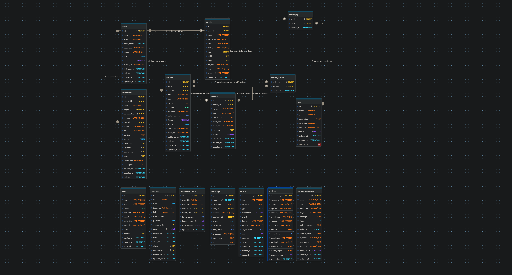

## Descripción General

Estructura completa de la base de datos para el CMS Laravel con **MariaDB**. Incluye todas las tablas necesarias para gestionar artículos, secciones, etiquetas, banners, configuración y contactos.

## Requisitos

- **MariaDB:** 10.2 o superior
- **Motor de almacenamiento:** InnoDB (para FOREIGN KEYS)
- **Charset:** utf8mb4 (soporte completo Unicode, emojis)
- **Collation:** utf8mb4_unicode_ci (comparación case-insensitive, acentos)

---

## Crear Base de Datos

```sql
CREATE DATABASE IF NOT EXISTS cms_vertex 
CHARACTER SET utf8mb4 
COLLATE utf8mb4_unicode_ci;

USE cms_vertex;
```

---

## Tablas

### 1. users

Tabla para gestionar usuarios con acceso a la administración.

```sql
CREATE TABLE IF NOT EXISTS users (
  id BIGINT UNSIGNED PRIMARY KEY AUTO_INCREMENT,
  name VARCHAR(255) NOT NULL,
  email VARCHAR(255) UNIQUE NOT NULL, -- Ya genera un índice único automáticamente
  email_verified_at TIMESTAMP NULL,
  password VARCHAR(255) NOT NULL,
  remember_token VARCHAR(100) NULL,
  role ENUM('admin', 'editor', 'viewer') DEFAULT 'editor',
  active BOOLEAN DEFAULT true,
  avatar_url VARCHAR(255) NULL,       -- Opcional: para el perfil en el panel React
  last_login_at TIMESTAMP NULL,      -- Mejora: Auditoría básica de seguridad
  deleted_at TIMESTAMP NULL,         -- Mejora: Soft Deletes
  created_at TIMESTAMP DEFAULT CURRENT_TIMESTAMP,
  updated_at TIMESTAMP DEFAULT CURRENT_TIMESTAMP ON UPDATE CURRENT_TIMESTAMP,
  KEY idx_role (role),
  KEY idx_status (active, deleted_at)
) ENGINE=InnoDB DEFAULT CHARSET=utf8mb4 COLLATE=utf8mb4_unicode_ci;
```

**Campos:**
- **id**: Identificador único (BigInt).
- **name**: Nombre completo del administrador o editor.
- **email**: Correo electrónico único (usado para login).
- **email_verified_at**: Timestamp de verificación de cuenta.
- **password**: Hash de la contraseña (Bcrypt).
- **remember_token**: Token para mantener la sesión activa.
- **role**: Permisos del usuario (admin, editor, viewer).
- **active**: Estado operativo de la cuenta.
- **avatar_url**: Ruta a la imagen de perfil del usuario.
- **last_login_at**: Registro de la última conexión para auditoría de seguridad.
- **deleted_at**: Timestamp para borrado lógico (Soft Delete).
- **created_at / updated_at**: Trazabilidad de creación y cambios.

---

### 2. sections

Tabla para almacenar las secciones de noticias.

```sql
CREATE TABLE IF NOT EXISTS sections (
  id BIGINT UNSIGNED PRIMARY KEY AUTO_INCREMENT,
  parent_id BIGINT UNSIGNED NULL, -- Mejora: Soporte para jerarquías (Subsecciones)
  name VARCHAR(255) NOT NULL UNIQUE,
  slug VARCHAR(255) NOT NULL UNIQUE, -- Ya genera un índice único automáticamente
  description TEXT NULL,
  meta_title VARCHAR(255) NULL,       -- Mejora: SEO para la página de la sección
  meta_description VARCHAR(160) NULL, -- Mejora: SEO para Next.js
  position INT DEFAULT 0,
  active BOOLEAN DEFAULT true,
  deleted_at TIMESTAMP NULL,          -- Mejora: Soft Deletes
  created_at TIMESTAMP DEFAULT CURRENT_TIMESTAMP,
  updated_at TIMESTAMP DEFAULT CURRENT_TIMESTAMP ON UPDATE CURRENT_TIMESTAMP,
  CONSTRAINT fk_sections_parent FOREIGN KEY (parent_id) REFERENCES sections(id) ON DELETE SET NULL,
  KEY idx_active_position (active, position, deleted_at) 
) ENGINE=InnoDB DEFAULT CHARSET=utf8mb4 COLLATE=utf8mb4_unicode_ci;
```

**Campos:**
- **id**: Identificador único.
- **parent_id**: ID de la sección padre (permite jerarquías/subcategorías).
- **name**: Nombre visible de la sección (ej: "Deportes").
- **slug**: URL amigable única (ej: "deportes-nacionales").
- **description**: Breve descripción para uso interno o cabeceras.
- **meta_title**: Título optimizado para SEO (`<title>`).
- **meta_description**: Descripción para buscadores.
- **position**: Orden numérico en menús y listas.
- **active**: Define si la sección es visible en el frontend.
- **deleted_at**: Borrado lógico para proteger la jerarquía.

---

### 3. articles

Tabla principal para almacenar artículos/noticias.

```sql
CREATE TABLE IF NOT EXISTS articles (
  id BIGINT UNSIGNED PRIMARY KEY AUTO_INCREMENT,
  section_id BIGINT UNSIGNED NOT NULL, -- Sección Principal
  user_id BIGINT UNSIGNED NOT NULL,
  title VARCHAR(255) NOT NULL,
  slug VARCHAR(255) NOT NULL UNIQUE,
  excerpt TEXT NULL,
  content LONGTEXT NOT NULL,
  featured_image VARCHAR(255) NULL,
  gallery_images JSON NULL,
  featured BOOLEAN DEFAULT false,
  status ENUM('draft', 'scheduled', 'published', 'archived') DEFAULT 'draft',
  meta_title VARCHAR(255) NULL,
  meta_description VARCHAR(160) NULL,
  published_at TIMESTAMP NULL,
  deleted_at TIMESTAMP NULL, -- Mejora: Soft Deletes
  created_at TIMESTAMP DEFAULT CURRENT_TIMESTAMP,
  updated_at TIMESTAMP DEFAULT CURRENT_TIMESTAMP ON UPDATE CURRENT_TIMESTAMP,
  CONSTRAINT fk_articles_section FOREIGN KEY (section_id) REFERENCES sections(id) ON DELETE RESTRICT,
  CONSTRAINT fk_articles_user FOREIGN KEY (user_id) REFERENCES users(id) ON DELETE RESTRICT,  
  -- 1. Para la home y listados generales
  KEY idx_status_published (status, published_at, deleted_at),
  -- 2. Para los listados de cada sección (Next.js SSR)
  KEY idx_section_status_date (section_id, status, published_at),
  -- 3. Para buscar noticias destacadas
  KEY idx_featured_status (featured, status),
  KEY idx_user_id (user_id)
) ENGINE=InnoDB DEFAULT CHARSET=utf8mb4 COLLATE=utf8mb4_unicode_ci;
```

**Campos:**
- **id**: Identificador único.
- **section_id**: FK a la sección principal obligatoria.
- **user_id**: FK al autor del artículo.
- **title**: Titular de la noticia.
- **slug**: URL única generada a partir del título.
- **excerpt**: Resumen corto para listados y redes sociales.
- **content**: Cuerpo completo (HTML/Bloques).
- **featured_image**: URL de la imagen principal.
- **gallery_images**: JSON con array de imágenes secundarias.
- **featured**: Destacado en home.
- **status**: (draft, scheduled, published, archived).
- **meta_title / meta_description**: SEO On-Page.
- **published_at**: Fecha de publicación.
- **deleted_at**: Soft Delete.

---

### 4. tags

Tabla para almacenar etiquetas.

```sql
CREATE TABLE IF NOT EXISTS tags (
  id BIGINT UNSIGNED PRIMARY KEY AUTO_INCREMENT,
  name VARCHAR(255) NOT NULL UNIQUE,
  slug VARCHAR(255) NOT NULL UNIQUE,
  description TEXT NULL,
  meta_title VARCHAR(255) NULL,
  meta_description VARCHAR(160) NULL,
  active BOOLEAN DEFAULT true,
  deleted_at TIMESTAMP NULL, -- Mejora: Soft Deletes
  created_at TIMESTAMP DEFAULT CURRENT_TIMESTAMP,
  updated_at TIMESTAMP DEFAULT CURRENT_TIMESTAMP ON UPDATE CURRENT_TIMESTAMP,
  KEY idx_active_status (active, deleted_at)
) ENGINE=InnoDB DEFAULT CHARSET=utf8mb4 COLLATE=utf8mb4_unicode_ci;
```

**Campos:**
- **id**: Identificador único.
- **name**: Nombre (ej: "IA").
- **slug**: URL amigable.
- **description**: Texto descriptivo.
- **meta_title / meta_description**: SEO.
- **active**: Estado.
- **deleted_at**: Borrado lógico.

---

### 5. article_tag

Tabla pivote para relación many-to-many entre artículos y etiquetas.

```sql
CREATE TABLE IF NOT EXISTS article_tag (
  article_id BIGINT UNSIGNED NOT NULL,
  tag_id BIGINT UNSIGNED NOT NULL,
  created_at TIMESTAMP DEFAULT CURRENT_TIMESTAMP,
  PRIMARY KEY (article_id, tag_id),
  CONSTRAINT fk_article_tag_article FOREIGN KEY (article_id) REFERENCES articles(id) ON DELETE CASCADE,
  CONSTRAINT fk_article_tag_tag FOREIGN KEY (tag_id) REFERENCES tags(id) ON DELETE CASCADE,  
  KEY idx_tag_id (tag_id)
) ENGINE=InnoDB DEFAULT CHARSET=utf8mb4 COLLATE=utf8mb4_unicode_ci;
```

**Campos:**
- **article_id**: FK al artículo.
- **tag_id**: FK a la etiqueta.
- **created_at**: Fecha de asignación.

---

### 6. banners

Tabla para almacenar banners publicitarios.

```sql
CREATE TABLE IF NOT EXISTS banners (
  id BIGINT UNSIGNED PRIMARY KEY AUTO_INCREMENT,
  title VARCHAR(255) NOT NULL,  
  type ENUM('image', 'code') NOT NULL DEFAULT 'image',  
  image_url VARCHAR(255) NULL,   -- Ahora permite NULL para banners de tipo 'code'
  link_url VARCHAR(255) NULL,    -- Opcional para imágenes, irrelevante para código
  code_content TEXT NULL,        -- Nuevo: Aquí se guarda el script o HTML puro  
  position ENUM('header', 'sidebar', 'between_articles', 'footer') NOT NULL,
  display_order INT DEFAULT 0,  
  active BOOLEAN DEFAULT true,
  deleted_at TIMESTAMP NULL,     -- Consistencia: Soft Deletes
  starts_at TIMESTAMP NULL,      -- Programación de inicio
  ends_at TIMESTAMP NULL,        -- Programación de fin (expiración)
  clicks INT UNSIGNED DEFAULT 0,
  impressions INT UNSIGNED DEFAULT 0,
  created_at TIMESTAMP DEFAULT CURRENT_TIMESTAMP,
  updated_at TIMESTAMP DEFAULT CURRENT_TIMESTAMP ON UPDATE CURRENT_TIMESTAMP,
  KEY idx_position_active_order (position, active, display_order, deleted_at)
) ENGINE=InnoDB DEFAULT CHARSET=utf8mb4 COLLATE=utf8mb4_unicode_ci;
```

**Campos:**
- **id**: Identificador único.
- **title**: Nombre de la campaña.
- **type**: (image, code).
- **image_url**: Ruta de imagen.
- **link_url**: URL destino.
- **code_content**: HTML/script externo.
- **position**: Ubicación (header, sidebar).
- **display_order**: Prioridad.
- **active**: Estado.
- **deleted_at**: Borrado lógico.
- **starts_at / ends_at**: Rango de fechas.
- **clicks / impressions**: Métricas.

---

### 7. homepage_config

Tabla para almacenar la configuración de la portada (singleton - un único registro).

```sql
CREATE TABLE IF NOT EXISTS homepage_config (
  id TINYINT UNSIGNED PRIMARY KEY DEFAULT 1,
  meta_title VARCHAR(255) NULL,
  meta_description VARCHAR(160) NULL,  
  featured_articles_count TINYINT UNSIGNED DEFAULT 6,
  latest_articles_count TINYINT UNSIGNED DEFAULT 10,  
  layout_schema JSON NULL, 
  banners_enabled BOOLEAN DEFAULT true,
  show_notices BOOLEAN DEFAULT true,
  updated_at TIMESTAMP DEFAULT CURRENT_TIMESTAMP ON UPDATE CURRENT_TIMESTAMP,
  CONSTRAINT uc_homepage_config_single CHECK (id = 1)
) ENGINE=InnoDB DEFAULT CHARSET=utf8mb4 COLLATE=utf8mb4_unicode_ci;
INSERT IGNORE INTO homepage_config (id, meta_title, featured_articles_count, latest_articles_count) 
VALUES (1, 'Portada Principal', 6, 10);
```

**Campos:**
- **id**: Siempre 1.
- **meta_title / meta_description**: SEO home.
- **featured_articles_count**: Nº destacados.
- **latest_articles_count**: Nº recientes.
- **layout_schema**: JSON de diseño.
- **banners_enabled**: Toggle publicidad.
- **show_notices**: Toggle avisos.

---

### 8. settings

Tabla para almacenar configuración general del sitio (singleton - un único registro).

```sql
CREATE TABLE IF NOT EXISTS settings (
  id TINYINT UNSIGNED PRIMARY KEY DEFAULT 1,
  site_name VARCHAR(255) NOT NULL DEFAULT 'Mi CMS',
  site_description VARCHAR(160) NULL, -- Optimizado para meta-description (máx 160)
  logo_url VARCHAR(255) NULL,
  favicon_url VARCHAR(255) NULL,
  brand_color VARCHAR(7) DEFAULT '#000000',
  contact_email VARCHAR(255) NULL,
  phone_number VARCHAR(20) NULL,
  address TEXT NULL,
  -- Permite guardar: {"facebook": "url", "tiktok": "url", "threads": "url"}
  -- Sin necesidad de añadir columnas nuevas cada vez que surja una red social.
  social_links JSON NULL,
  google_analytics_id VARCHAR(50) NULL,
  facebook_pixel_id VARCHAR(50) NULL,
  header_scripts TEXT NULL, 
  footer_scripts TEXT NULL,
  maintenance_mode BOOLEAN DEFAULT false,
  updated_at TIMESTAMP DEFAULT CURRENT_TIMESTAMP ON UPDATE CURRENT_TIMESTAMP,
  CONSTRAINT uc_settings_single CHECK (id = 1)
) ENGINE=InnoDB DEFAULT CHARSET=utf8mb4 COLLATE=utf8mb4_unicode_ci;
INSERT IGNORE INTO settings (id, site_name, social_links) 
VALUES (1, 'Mi CMS', '{}');
```

**Campos:**
- **id**: Siempre 1.
- **site_name**: Nombre del sitio.
- **site_description**: Descripción base.
- **logo_url / favicon_url**: Identidad visual.
- **brand_color**: Color HEX.
- **contact_email / phone_number / address**: Contacto.
- **social_links**: JSON redes sociales.
- **google_analytics_id / facebook_pixel_id**: Tracking.
- **header_scripts / footer_scripts**: Scripts globales.
- **maintenance_mode**: Modo mantenimiento.

---

### 9. notices

Tabla para almacenar avisos/notificaciones del sitio.

```sql
CREATE TABLE IF NOT EXISTS notices (
  id BIGINT UNSIGNED PRIMARY KEY AUTO_INCREMENT,
  title VARCHAR(255) NOT NULL,
  message TEXT NOT NULL,
  type ENUM('info', 'warning', 'error', 'success') DEFAULT 'info',
  dismissible BOOLEAN DEFAULT true, -- Si el usuario puede cerrarlo
  priority INT DEFAULT 0,           -- Para ordenar si hay varios avisos simultáneos
  link_label VARCHAR(50) NULL,      -- Texto del botón (ej: "Saber más")
  link_url VARCHAR(255) NULL,       -- URL de destino
  target_pages JSON NULL,
  -- Control de Estado y Programación
  active BOOLEAN DEFAULT true,
  starts_at TIMESTAMP NULL,         -- Programación: Cuándo empieza a mostrarse
  ends_at TIMESTAMP NULL,           -- Programación: Cuándo caduca
  deleted_at TIMESTAMP NULL,        -- Soft Deletes para auditoría
  created_at TIMESTAMP DEFAULT CURRENT_TIMESTAMP,
  updated_at TIMESTAMP DEFAULT CURRENT_TIMESTAMP ON UPDATE CURRENT_TIMESTAMP,  
  KEY idx_active_priority_dates (active, priority, starts_at, ends_at, deleted_at)
) ENGINE=InnoDB DEFAULT CHARSET=utf8mb4 COLLATE=utf8mb4_unicode_ci;
```

**Campos:**
- **id**: Identificador único.
- **title**: Titular.
- **message**: Contenido.
- **type**: (info, warning, error, success).
- **dismissible**: Se puede cerrar.
- **priority**: Importancia.
- **link_label / link_url**: CTA.
- **target_pages**: JSON de URLs.
- **active**: Estado.
- **starts_at / ends_at**: Vigencia.
- **deleted_at**: Borrado lógico.

---

### 10. contact_messages

Tabla para almacenar mensajes de contacto.

```sql
CREATE TABLE IF NOT EXISTS contact_messages (
  id BIGINT UNSIGNED PRIMARY KEY AUTO_INCREMENT,
  -- Datos del Remitente
  name VARCHAR(255) NOT NULL,
  email VARCHAR(255) NOT NULL,
  phone_number VARCHAR(20) NULL,
  -- Contenido
  subject VARCHAR(255) NOT NULL,
  message TEXT NOT NULL,
  -- Gestión de Estado
  status ENUM('new', 'read', 'replied', 'archived', 'spam') DEFAULT 'new',
  -- Respuesta e Historial
  reply_message TEXT NULL,
  replied_at TIMESTAMP NULL,       -- Nuevo: Para saber cuándo se contestó exactamente
  internal_notes TEXT NULL,        -- Nuevo: Notas internas para los administradores
  ip_address VARCHAR(45) NULL,     -- IPv4 o IPv6
  user_agent TEXT NULL,            -- Navegador/Dispositivo desde el que escribieron
  source_url VARCHAR(255) NULL,    -- Desde qué página del Next.js mandaron el mensaje
  privacy_accepted BOOLEAN DEFAULT false,
  created_at TIMESTAMP DEFAULT CURRENT_TIMESTAMP,
  updated_at TIMESTAMP DEFAULT CURRENT_TIMESTAMP ON UPDATE CURRENT_TIMESTAMP,
  KEY idx_email (email),
  KEY idx_status_created (status, created_at)
) ENGINE=InnoDB DEFAULT CHARSET=utf8mb4 COLLATE=utf8mb4_unicode_ci;
```

**Campos:**
- **id**: Identificador único.
- **name / email / phone_number**: Remitente.
- **subject**: Asunto.
- **message**: Contenido.
- **status**: (new, read, replied, archived, spam).
- **reply_message**: Respuesta.
- **replied_at**: Fecha respuesta.
- **internal_notes**: Notas internas.
- **ip_address / user_agent**: Antispam.
- **source_url**: Origen.
- **privacy_accepted**: Consentimiento legal.

---

### 11. media

Tabla para gestionar archivos y medios subidos.

```sql
CREATE TABLE IF NOT EXISTS media (
  id BIGINT UNSIGNED PRIMARY KEY AUTO_INCREMENT,
  user_id BIGINT UNSIGNED NULL, -- Cambiado a NULL: Si un usuario se borra, las fotos se mantienen
  -- Información de Archivo y Almacenamiento
  name VARCHAR(255) NOT NULL,
  file_name VARCHAR(255) NOT NULL,
  disk VARCHAR(50) DEFAULT 'public',
  mime_type VARCHAR(100),            -- Tipo (image/webp, application/pdf)
  size BIGINT UNSIGNED,              -- Tamaño en bytes
  -- Metadata para Next.js
  width INT UNSIGNED NULL,           -- Evita Layout Shift en el frontend
  height INT UNSIGNED NULL,          -- Permite a Next.js reservar el espacio
  -- SEO y Accesibilidad
  alt_text VARCHAR(255) NULL,        -- Fundamental para SEO y lectores de pantalla
  title VARCHAR(255) NULL,
  -- Organización
  folder VARCHAR(100) DEFAULT '/',   -- Categorización básica por carpetas
  created_at TIMESTAMP DEFAULT CURRENT_TIMESTAMP,
  CONSTRAINT fk_media_user FOREIGN KEY (user_id) REFERENCES users(id) ON DELETE SET NULL,
  KEY idx_user_id (user_id),
  KEY idx_mime_type_folder (mime_type, folder),
  KEY idx_created_at (created_at)
) ENGINE=InnoDB DEFAULT CHARSET=utf8mb4 COLLATE=utf8mb4_unicode_ci;
```

**Campos:**
- **id**: Identificador único.
- **user_id**: FK usuario (SET NULL al borrar).
- **name**: Nombre original.
- **file_name**: Nombre almacenado.
- **disk**: (public, s3, cloudinary).
- **mime_type**: Tipo archivo.
- **size**: Bytes.
- **width / height**: Dimensiones.
- **alt_text**: Accesibilidad/SEO.
- **title**: Título opcional.
- **folder**: Organización.

---

### 12. comments

Tabla para almacenar comentarios en artículos.

```sql
CREATE TABLE IF NOT EXISTS comments (
  id BIGINT UNSIGNED PRIMARY KEY AUTO_INCREMENT,
  
  -- Jerarquía Optimizada
  parent_id BIGINT UNSIGNED NULL,
  path VARCHAR(255) NOT NULL,       -- Ruta jerárquica (ej: "00001/00004/00009")
  depth TINYINT UNSIGNED DEFAULT 0, -- Nivel de anidación (útil para indentación en CSS)
  
  -- Relación Polimórfica
  commentable_id BIGINT UNSIGNED NOT NULL,
  commentable_type VARCHAR(255) NOT NULL,
  
  -- Autoría
  user_id BIGINT UNSIGNED NULL,
  name VARCHAR(255) NOT NULL,
  email VARCHAR(255) NOT NULL,
  content TEXT NOT NULL,
  
  -- Moderación
  status ENUM('pending', 'approved', 'rejected', 'spam') DEFAULT 'pending',
  
  -- Analítica de Engagement 
  reply_count INT UNSIGNED DEFAULT 0,
  
¡  upvotes INT DEFAULT 0,  
  downvotes INT DEFAULT 0,
  score INT AS (upvotes - downvotes) VIRTUAL, -- Ahora MariaDB lo acepta sin problemas
  
  -- Auditoría
  ip_address VARCHAR(45) NULL,
  user_agent TEXT NULL,
  created_at TIMESTAMP DEFAULT CURRENT_TIMESTAMP,
  updated_at TIMESTAMP DEFAULT CURRENT_TIMESTAMP ON UPDATE CURRENT_TIMESTAMP,
  deleted_at TIMESTAMP NULL,
  
  CONSTRAINT fk_comments_user FOREIGN KEY (user_id) REFERENCES users(id) ON DELETE SET NULL,
  
  -- ÍNDICES
  KEY idx_tree_load (commentable_type, commentable_id, status, path),
  KEY idx_analytics_score (commentable_type, commentable_id, score DESC)
) ENGINE=InnoDB DEFAULT CHARSET=utf8mb4 COLLATE=utf8mb4_unicode_ci;
```

**Campos:**
- **id**: Identificador único.
- **parent_id**: Comentario padre.
- **commentable_id / commentable_type**: Relación polimórfica.
- **user_id**: Usuario (NULL si anónimo).
- **name / email**: Autor.
- **content**: Texto.
- **status**: (pending, approved, rejected, spam).
- **ip_address / user_agent**: Auditoría.
- **deleted_at**: Soft delete.

---

### 13. pages

Tabla para almacenar páginas estáticas (About, Privacy, Terms, etc.).

```sql
CREATE TABLE IF NOT EXISTS pages (
  id BIGINT UNSIGNED PRIMARY KEY AUTO_INCREMENT,
  -- Identidad y Contenido
  title VARCHAR(255) NOT NULL,
  slug VARCHAR(255) NOT NULL UNIQUE, -- Ya genera un índice único
  content LONGTEXT NOT NULL,
  featured_image VARCHAR(255) NULL,
  layout VARCHAR(50) DEFAULT 'default',
  meta_title VARCHAR(255) NULL,
  meta_description VARCHAR(160) NULL,
  -- Control de Estado y Orden
  status ENUM('draft', 'published', 'archived') DEFAULT 'draft',
  position INT DEFAULT 0, -- Útil para ordenar páginas en el footer o menús
  deleted_at TIMESTAMP NULL, -- Soft Deletes para seguridad
  created_at TIMESTAMP DEFAULT CURRENT_TIMESTAMP,
  updated_at TIMESTAMP DEFAULT CURRENT_TIMESTAMP ON UPDATE CURRENT_TIMESTAMP,
  KEY idx_status_position (status, position, deleted_at)
) ENGINE=InnoDB DEFAULT CHARSET=utf8mb4 COLLATE=utf8mb4_unicode_ci;
```

**Campos:**
- **id**: Identificador único.
- **title**: Título.
- **slug**: URL amigable.
- **content**: HTML.
- **featured_image**: Imagen.
- **layout**: Plantilla (landing, default).
- **meta_title / meta_description**: SEO.
- **status**: (draft, published, archived).
- **position**: Orden.
- **deleted_at**: Soft delete.

---

### 14. audit_logs

Tabla para registrar cambios y acciones realizadas en el CMS.

```sql
CREATE TABLE IF NOT EXISTS audit_logs (
  id BIGINT UNSIGNED PRIMARY KEY AUTO_INCREMENT,
  -- Quién realizó la acción
  user_id BIGINT UNSIGNED NULL,      -- NULL si fue una acción del sistema (ej: comando programado)
  auditable_type VARCHAR(255) NOT NULL,
  auditable_id BIGINT UNSIGNED NOT NULL,
  action ENUM('create', 'update', 'delete', 'restore') NOT NULL,
  old_values JSON NULL,
  new_values JSON NULL,
  ip_address VARCHAR(45) NULL,
  user_agent TEXT NULL,
  url TEXT NULL,
  created_at TIMESTAMP DEFAULT CURRENT_TIMESTAMP,
  CONSTRAINT fk_audit_logs_user FOREIGN KEY (user_id) REFERENCES users(id) ON DELETE SET NULL,
  -- 1. Búsqueda por historial de un registro específico
  KEY idx_auditable_model (auditable_type, auditable_id),
  -- 2. Búsqueda por actividad de un usuario
  KEY idx_user_action (user_id, created_at),  
  KEY idx_created_at (created_at)
) ENGINE=InnoDB DEFAULT CHARSET=utf8mb4 COLLATE=utf8mb4_unicode_ci;
```

**Campos:**
- **id**: Identificador único.
- **user_id**: Responsable.
- **auditable_type / auditable_id**: Referencia afectada.
- **action**: (create, update, delete, restore).
- **old_values / new_values**: JSON (delta).
- **ip_address / user_agent**: Origen técnico.
- **url**: Ruta del CMS.
- **created_at**: Fecha del evento.

---

## Diagramas de Relaciones



**Lectura rápida del diagrama:**
- El bloque editorial principal conecta users, sections, articles, tags y article_tag.
- comments es polimórfica y puede colgar de articles o pages, además de soportar respuestas anidadas.
- homepage_config y settings siguen visibles como tablas singleton de configuración.
- banners, notices y contact_messages quedan como tablas operativas independientes dentro del ecosistema del CMS.

---

## Índices Pivote

Se han diseñado y creado algunas tablas pivote para ayudar a la lectura de consultas y aumentar el rendimiento de la base de datos.

| Tabla | Índice | Propósito |
|-------|--------|----------|
| users | idx_status (active, deleted_at) | Acelera la autenticación y filtrado de cuentas operativas |
| users | idx_role (role) | Optimiza la gestión de permisos en el panel administrativo |
| sections | idx_active_position (active, position, deleted_at) | Carga menús ordenados sin filesort (índice de cobertura) |
| articles | idx_status_published (status, published_at, deleted_at) | Optimiza feed principal y noticias recientes |
| articles | idx_section_status_date (section_id, status, published_at) | Listado eficiente de artículos por categoría |
| articles | idx_featured_status (featured, status) | Recuperación rápida de contenido destacado |
| tags | idx_active_status (active, deleted_at) | Filtrado rápido de etiquetas activas |
| article_tag | idx_tag_id (tag_id) | Búsqueda inversa de artículos por etiqueta |
| banners | idx_position_active_order (position, active, display_order, deleted_at) | Carga de banners por ubicación y prioridad |
| notices | idx_active_priority_dates (active, priority, starts_at, ends_at) | Avisos activos ordenados por prioridad |
| contact_messages | idx_status_created (status, created_at) | Gestión eficiente de bandeja de entrada |
| media | idx_mime_type_folder (mime_type, folder) | Filtrado por tipo de archivo y carpeta |
| media | idx_user_id (user_id) | Trazabilidad de archivos por usuario |
| comments | idx_commentable_status (commentable_type, commentable_id, status) | Carga de comentarios polimórficos aprobados |
| comments | idx_parent_id (parent_id) | Reconstrucción eficiente de hilos |
| pages | idx_status_position (status, position, deleted_at) | Carga optimizada de páginas en menús |
| audit_logs | idx_auditable_model (auditable_type, auditable_id) | Historial de cambios por entidad |
| audit_logs | idx_user_action (user_id, created_at) | Auditoría de actividad por usuario |

---

## Migraciones Laravel

Los comandos Artisan para crear las migraciones serían:

```bash
php artisan make:model User -m
php artisan make:model Section -m
php artisan make:model Article -m
php artisan make:model Tag -m
php artisan make:model Banner -m
php artisan make:model Notice -m
php artisan make:model ContactMessage -m
php artisan make:model HomepageConfig -m
php artisan make:model Setting -m
php artisan make:model Media -m
php artisan make:model Comment -m
php artisan make:model Page -m
php artisan make:model AuditLog -m
```

---

## Relaciones en Laravel

Las relaciones entre modelos serían:

**User.php**
```php
// Un usuario puede realizar múltiples acciones
public function articles() { return $this->hasMany(Article::class); }
public function media() { return $this->hasMany(Media::class); }
public function comments() { return $this->hasMany(Comment::class); }
public function auditLogs() { return $this->hasMany(AuditLog::class); }
```

**Article.php**
```php
use Illuminate\Database\Eloquent\SoftDeletes;

class Article extends Model {
    use SoftDeletes;

    // Autor de la noticia
    public function user() { return $this->belongsTo(User::class); }

    // SECCIÓN PRINCIPAL (1:N)
    public function section() { return $this->belongsTo(Section::class); }

    // SECCIONES SECUNDARIAS (N:M)
    public function secondarySections() { 
        return $this->belongsToMany(Section::class, 'article_section'); 
    }

    // Etiquetas (N:M)
    public function tags() { return $this->belongsToMany(Tag::class, 'article_tag'); }

    // Comentarios asociados (Polimórfico)
    public function comments() { return $this->morphMany(Comment::class, 'commentable'); }
}
```

**Section.php**
```php
class Section extends Model {
    // Jerarquía de secciones
    public function parent() { return $this->belongsTo(Section::class, 'parent_id'); }
    public function children() { return $this->hasMany(Section::class, 'parent_id'); }

    // Artículos donde esta es la sección PRINCIPAL
    public function mainArticles() { return $this->hasMany(Article::class); }

    // Artículos donde esta es una sección SECUNDARIA
    public function secondaryArticles() { 
        return $this->belongsToMany(Article::class, 'article_section'); 
    }
}
```

**Tag.php**
```php
class Tag extends Model {
    public function articles() { return $this->belongsToMany(Article::class, 'article_tag'); }
}
```

**Comment.php**
```php
class Comment extends Model {
    // Relación polimórfica (Permite comentar Artículos, Páginas, etc.)
    public function commentable() { return $this->morphTo(); }

    // El autor puede ser un usuario registrado o nulo (invitado)
    public function user() { return $this->belongsTo(User::class); }

    // Sistema de hilos/respuestas
    public function parent() { return $this->belongsTo(Comment::class, 'parent_id'); }
    public function replies() { return $this->hasMany(Comment::class, 'parent_id'); }
}
```

**Page.php**
```php
class Page extends Model {
    // Las páginas también pueden recibir comentarios
    public function comments() { return $this->morphMany(Comment::class, 'commentable'); }
}
```

**Media.php**
```php
class Media extends Model {
    // Usuario que subió el archivo (Relación opcional por SET NULL)
    public function user() { return $this->belongsTo(User::class); }
}
```

**AuditLog.php**
```php
class AuditLog extends Model {
    // Quién ejecutó la acción
    public function user() { return $this->belongsTo(User::class); }
    // Qué objeto fue modificado (Polimórfico: Article, Section, User, etc.)
    public function auditable() { return $this->morphTo(); }
}
```

---

## Notas Importantes

### Diseño de Base de Datos
- **Charset:** Todas las tablas usan `utf8mb4` para soporte completo de caracteres Unicode y emojis
- **Collation:** `utf8mb4_unicode_ci` para comparación case-insensitive con acentos correctamente
- **Motor:** InnoDB obligatorio para FOREIGN KEYS y transacciones
- **Timestamps:** Todas las tablas tienen `created_at` y `updated_at` para auditoría completa

### Campos Especiales
- **Slugs:** Campos únicos para URLs amigables (ej: "/articles/mi-primer-articulo")
- **Status de artículos:** draft (borrador), scheduled (programado), published (publicado), archived (archivado)
- **Posiciones de banners:** header (cabecera), sidebar (barra lateral), between_articles (entre noticias), footer (pie)
- **Tipos de avisos:** info, warning, error, success
- **Roles de usuarios:** admin (administrador), editor (editor de contenido), viewer (solo lectura)

### Tablas Especiales
- **Tabla pivote `article_tag`:** Relación many-to-many entre artículos y etiquetas sin ID autoincremental
- **Tablas singleton:** `homepage_config` y `settings` solo deben tener un registro (id=1) con CHECK CONSTRAINT
- **Valores por defecto:** Se inserta automáticamente en homepage_config y settings

### Integridad Referencial
- Se utilizan FOREIGN KEYS con nombres explícitos para mantener integridad referencial
- Configurado `ON DELETE CASCADE` para eliminar datos relacionados automáticamente
- Todos los CONSTRAINTS tienen nombres descriptivos para facilitar mantenimiento

### Optimizaciones
- Índices en campos frecuentemente buscados (slugs, emails, estados)
- Índices en campos con filtros frecuentes (active, type, position)
- Índices en campos de ordenamiento (published_at, position, priority)
- Índices en claves foráneas para mejorar JOINs

### Seguridad
- Las contraseñas deben hashearse con bcrypt (mín. 60 caracteres para almacenamiento)
- Email verificado mediante timestamp null/no null
- Modo mantenimiento para pausar el sitio si es necesario
- Sistema de lectura/respuesta para mensajes de contacto

### Campos Numéricos
- IDs: BIGINT UNSIGNED (soporta hasta 2^64-1 registros)
- Posiciones/órdenes: INT (suficiente para ordenamientos)
- Clics/impresiones: INT UNSIGNED para contadores no negativos
- Prioridad: INT (permite valores negativos si es necesario)
- Conteos: INT UNSIGNED para valores siempre positivos

### JSON Fields
- `sections_displayed` en homepage_config: Array de IDs de secciones (ej: `[1,2,3,4]`)
- `old_values` y `new_values` en audit_logs: Capturan cambios en formato JSON para trazabilidad completa
- Permite flexibilidad futura para configuraciones complejas

---

## Script SQL Completo (MariaDB)

Para crear todas las tablas de una vez, ejecuta:

```bash
mysql -u root -p cms_laravel < schema.sql
```

O en la consola de MariaDB:
```sql
USE cms_laravel;
SOURCE /ruta/al/archivo/schema.sql;
```

O simplemente copia y pega todo el SQL de cada tabla en orden.