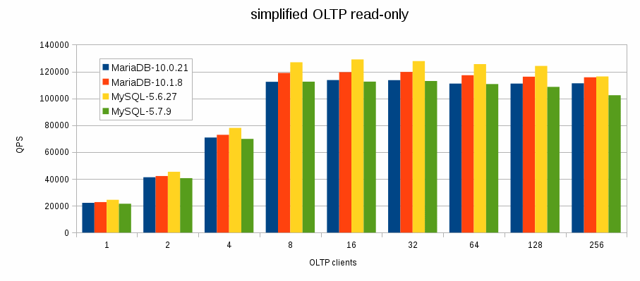
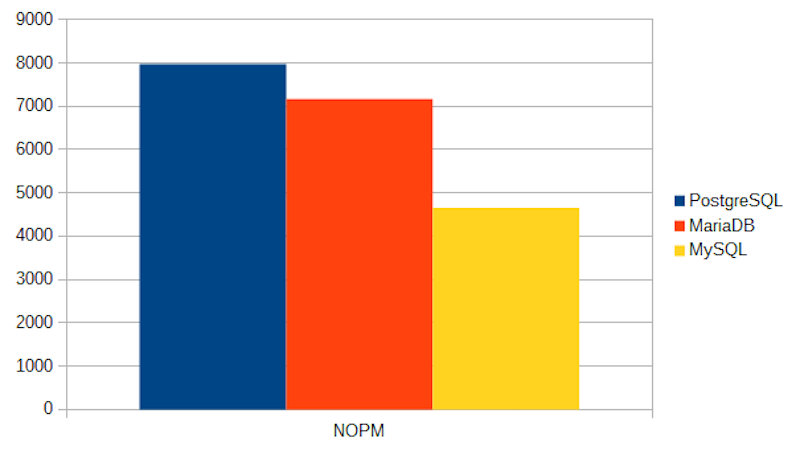

# Base de datos del proyecto

## Índice
- [Introducción](#introducción)
- [Elección de la base de datos](#elección-de-la-base-de-datos)

## Introducción

Este documento presenta la comparación y elección de la base de datos para el proyecto. Se evaluarán sus características principales, ventajas y desventajas para determinar cuál es la mejor opción para nuestro proyecto. 

Además, se discutirá la importancia de la base de datos en el contexto del proyecto y cómo su elección puede afectar el rendimiento, la escalabilidad y la seguridad de la aplicación. 

Se definirán las tablas necesarias para almacenar la información, además de las relaciones entre ellas, para garantizar una estructura de datos eficiente y escalable. También se considerarán aspectos como la facilidad de uso, la compatibilidad con otras tecnologías utilizadas en el proyecto y el soporte disponible para cada base de datos.

## Elección de la base de datos
De las posibles opciones de bases de datos, se han seleccionado MySQL y MariaDB para su evaluación. Ambas son bases de datos relacionales ampliamente utilizadas, con características similares, pero con algunas diferencias clave que pueden influir en el rendimiento y la escalabilidad del proyecto.

### MySQL

MySQL es una base de datos relacional, con una capacidad de escalabilidad y rendimiento adecuados. A continuación, se presentan algunas de sus características principales, ventajas y desventajas:

#### Características principales
- Es una base de datos relacional ampliamente utilizada.
- Tiene una buena capacidad de escalabilidad.
- Cuenta con una gran comunidad de soporte.
#### Ventajas
- Es de código abierto y gratuito.
- Es compatible con una gran cantidad de sistemas operativos y lenguajes de programación.
- Tiene una buena capacidad de escalabilidad y rendimiento.
- Es ampliamente utilizado, lo que facilita la búsqueda de recursos y soporte.
- Ofrece una amplia gama de herramientas y complementos para mejorar su funcionalidad.

#### Desventajas
- Puede tener problemas de rendimiento en entornos de alta carga.
- Algunas funcionalidades avanzadas están disponibles solo en versiones pagadas.
- Ofrece una infraestructura más pobre en comparación con otras bases de datos, como MariaDB, lo que puede afectar su rendimiento y escalabilidad en situaciones de alta carga.

### MariaDB
MariaDB es un fork de MySQL, creada por los desarrolladores originales de MySQL. A continuación, se presentan algunas de sus características principales, ventajas y desventajas:

#### Características principales
- Es una base de datos relacional, similar a MySQL.
- Tiene una buena capacidad de escalabilidad y rendimiento.
- Es compatible con MySQL, lo que facilita la migración.
- Cuenta con una gran comunidad de soporte.

#### Ventajas
- Es compatible con muchos motores de almacenamiento.
- Es compatible con MySQL, lo que facilita la migración.
- Tiene una buena capacidad de escalabilidad y rendimiento.
- En situaciones de carga alta, ofrece un mejor rendimiento que MySQL.
- Puede manejar mayor número de conexiones simultáneas que MySQL.
- Posee una mejor infraestructura de seguridad, almacenamiento y escalabilidad en comparación con MySQL.

#### Desventajas
- Puede tener problemas de compatibilidad con algunas versiones de MySQL.
- Algunas funcionalidades avanzadas están disponibles solo en versiones pagadas.
- Al ser un fork de MySQL, puede tener problemas de compatibilidad con algunas aplicaciones que dependen de MySQL.

### Conclusión
Tras realizar una busqueda intensiva sobre características, ventajas y desventajas de ambas bases de datos, se ha decidido utilizar **MariaDB** para el proyecto. 

Esta decisión se basa en su mejor **rendimiento** en situaciones de **alta carga**, su **compatibilidad** con **MySQL**, y su **mejor infraestructura** de **seguridad**, **almacenamiento** y **escalabilidad** en comparación con MySQL.

Este gráfico muestra una comparación de rendimiento entre MySQL y MariaDB en situaciones de alta carga, donde se puede observar que MariaDB ofrece un mejor rendimiento que MySQL.

En este otro gráfico se muestra la comparación de lectura de datos entre MySQL, MariaDB y PostgreSQL, donde se puede observar que MariaDB tiene un mejor rendimiento que MySQL, pero peor que PostgreSQL.

> [!NOTE]
> PostgreSQL no se ha considerado como opción, debido a que es más pesado y complejo de configurar, lo que no se ajusta a las necesidades del proyecto. Además de que en situaciones de alta carga, a pesar de ser extremadamente rápido y robusto, puede ser más difícil de escalar y mantener en comparación con MariaDB.

> [!Important]
> En un caso de que el **CMS** llegara a utilizar en algún momento un **contenido dinámico**, como por ejemplo **bloques configurables** o **layouts personalizados**, se tendría que **considerar** el **uso** de **MariaDB** como base de datos.
>
> En ese **escenario**, podría ser más **adecuado** **migrar** hacia una **arquitectura** enfocada en bases de datos **NoSQL**, como MongoDB, **o** bien se podría considerar el **uso** de **PostgreSQL**, debido a que es más **robusto** y **escalable** que MySQL y MariaDB, aunque también es más **complejo** de **configurar** y **mantener**. 
> 
> Sin embargo, esta decisión dependerá de las necesidades específicas del proyecto en ese momento y se deberá evaluar cuidadosamente antes de tomar una decisión final.